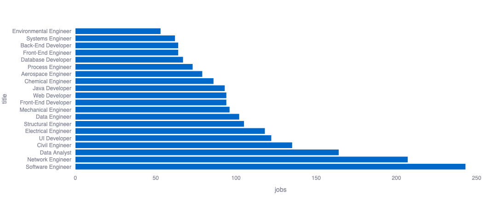

# Project: job market analysis [ON HOLD]

This project was made mostly to get a feeling of how to set up a data analysis project using standard python (pandas+postgresql+streamlit).

The base dataset is made of fake data, so charts are looking rather dull and not interesting. 



Follow the steps to run the project, assuming a db is available (local development done with a postgres docker container)

## Install dependencies and setup
```python
python -m venv venv 
source venv/bin/activate
pip install -r requirements.txt
psql -d jobs -f db/schema.sql
```
Don't forget to create a `.env` file with a connection string like this: `DB_URL=postgresql://username:password@db_url:5432/jobs` 

## Getting the data 
Set up `KAGGLE_API_TOKEN` as described in their docs.

`kaggle datasets download -d ravindrasinghrana/job-description-dataset`

And to populate the raw jobs table in the db:

`python -m scripts/run_ingestion`

## Transformation and Normalization 
I limited the scope to only for France and Switzerland to reduce compute time and since this is were I am looking for a job.

Run
`python -m scripts/run_normalization`

## Deploy on streamlit
Export data in parquet format by running 
`python -m scripts/build_dev_dashboard_data`

then either run locally
`streamlit run dashboard/app.py`

Or if the streamlit integration is set up for the repo, just push the extracted data to github. 
A demo board can be found here (since I am on the free plan, the app goes to sleep regularly): 
`https://job-market-analysis-niotir.streamlit.app`

